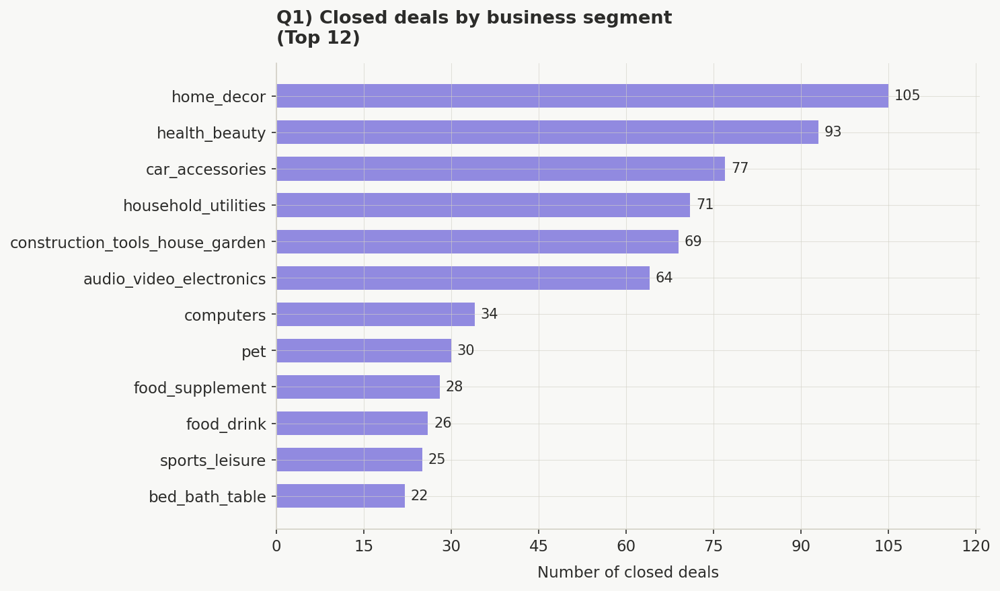
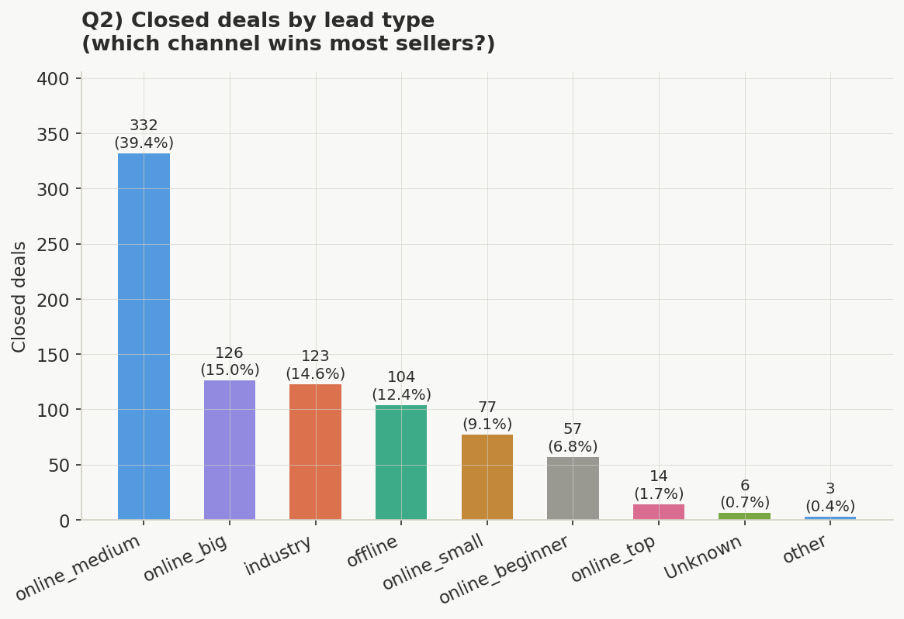
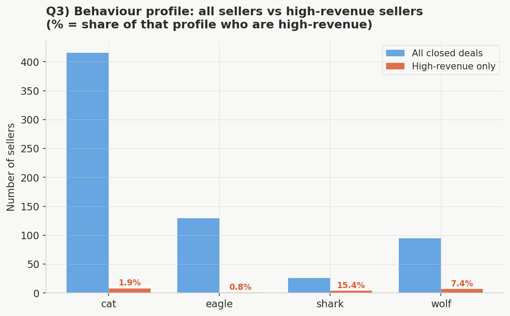
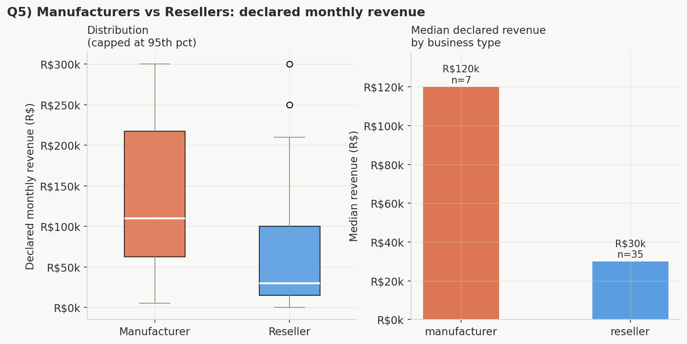
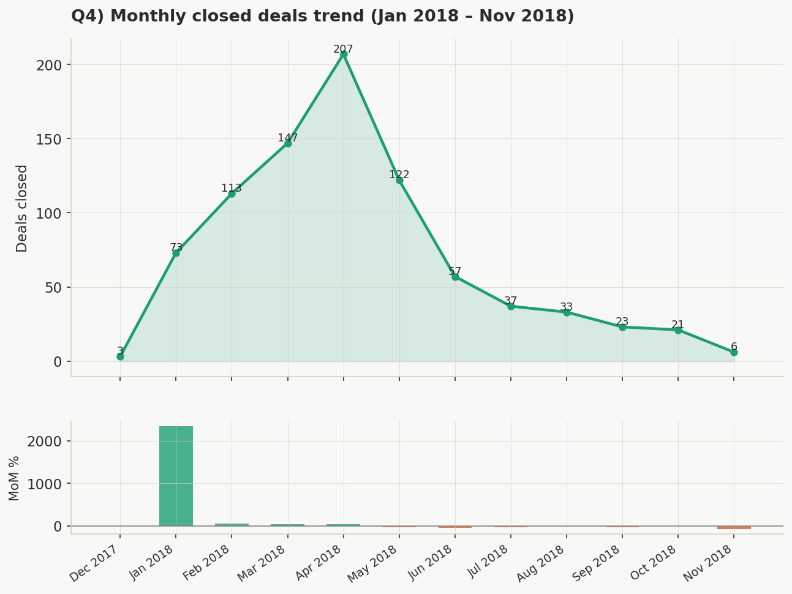

<div align="center">

# 📊 Olist Marketing Funnel & Conversion Analysis
### Future Interns — Data Science & Analytics · Task 3

[](https://python.org)
[](https://pandas.pydata.org)
[](https://matplotlib.org)
[](https://jupyter.org)
[](LICENSE)
[]()

<br/>

> **Analysed 842 real closed deals from Olist's e-commerce marketplace to uncover which segments, channels, and seller profiles drive the most conversions — and where the funnel breaks down.**

<br/>

[📓 View Notebook](#-notebook) · [📈 See Charts](#-key-visualisations) · [💡 Key Findings](#-key-findings) · [🛠 How to Run](#-how-to-run)

</div>

---

## 📁 Project Structure

```
FUTURE_DS_03/
│
├── 📓 questions.ipynb                  ← Main analysis notebook
├── 📄 olist_closed_deals_dataset.csv   ← Dataset (842 records)
├── 📁 output/
│   ├── q1_business_segment.png
│   ├── q2_lead_type.png
│   ├── q3_behaviour_profile.png
│   ├── q4_monthly_trend.png
│   └── q5_revenue_comparison.png
└── 📄 README.md
```

---

## 🎯 Objective

Analyse Olist's marketing funnel using real closed deal data to answer:

1. Which **business segments** generate the most closed deals?
2. Which **lead channel** (type) converts most often?
3. Which **seller behaviour profile** is most common among high-revenue sellers?
4. Is there a **month-over-month growth trend** in deal closures?
5. Do **manufacturers vs resellers** differ in declared revenue?

---

## 📦 Dataset

| Property | Detail |
|---|---|
| **Source** | [Olist Marketing Funnel — Kaggle](https://www.kaggle.com/datasets/olistbr/marketing-funnel-olist) |
| **File** | `olist_closed_deals_dataset.csv` |
| **Records** | 842 rows · 14 columns |
| **Period** | December 2017 – November 2018 |
| **What it represents** | Sellers who were successfully onboarded to the Olist marketplace |

<details>
<summary><b>📋 Column Reference (click to expand)</b></summary>

<br/>

| Column | Type | Description |
|---|---|---|
| `mql_id` | string | Unique Marketing Qualified Lead ID |
| `seller_id` | string | Unique seller identifier |
| `sdr_id` | string | Sales Development Representative ID |
| `sr_id` | string | Sales Representative ID |
| `won_date` | datetime | Date the deal was closed |
| `business_segment` | categorical | Product category (e.g. home_decor, health_beauty) |
| `lead_type` | categorical | Channel/size (online_medium, industry, offline, etc.) |
| `lead_behaviour_profile` | categorical | Sales-assigned personality (cat, wolf, eagle, shark) |
| `has_company` | boolean | Whether seller has a registered company |
| `has_gtin` | boolean | Whether seller has product barcodes |
| `average_stock` | categorical | Typical inventory level |
| `business_type` | categorical | Role in supply chain (reseller / manufacturer / other) |
| `declared_product_catalog_size` | float | Number of products declared |
| `declared_monthly_revenue` | float | Self-declared monthly revenue in R$ |

</details>

---

## 🔧 Data Cleaning Steps

<details>
<summary><b>🧹 View all cleaning decisions (click to expand)</b></summary>

<br/>

| Issue Found | Column(s) | Fix Applied |
|---|---|---|
| Dates stored as strings | `won_date` | Converted to `datetime64` |
| 0.0 means "not declared", not zero | `declared_monthly_revenue` | Replaced `0.0` → `NaN` |
| Multi-value cells e.g. `"eagle, wolf"` | `lead_behaviour_profile` | Extracted primary value before the comma |
| ~92% null | `has_company`, `has_gtin`, `average_stock` | Filled with `"Unknown"` or flagged |
| ~10 missing values | `business_type` | Filled with `"Unknown"` |
| 1 stray row from Dec 2017 | `won_date` | Retained but noted as outlier |

**Feature Engineering:**
- `won_month` — Period column for time-series grouping
- `won_quarter` — Quarter number for trend analysis  
- `is_high_revenue` — Boolean flag: revenue > median declared revenue (R$50,000)
- `has_full_profile` — Boolean: all three sparse fields are non-null
- `profile_primary` — Cleaned single-value version of `lead_behaviour_profile`

</details>

---

## 📈 Key Visualisations

<table>
  <tr>
    <td align="center"><b>Q1) Business Segment</b></td>
    <td align="center"><b>Q2) Lead Type / Channel</b></td>
  </tr>
  <tr>
    <td></td>
    <td></td>
  </tr>
  <tr>
    <td align="center"><b>Q3) Behaviour Profile vs Revenue</b></td>
    <td align="center"><b>Q5) Manufacturer vs Reseller Revenue</b></td>
  </tr>
  <tr>
    <td></td>
    <td></td>
  </tr>
  <tr>
    <td colspan="2" align="center"><b>Q4) Monthly Deal Closure Trend</b></td>
  </tr>
  <tr>
    <td colspan="2"></td>
  </tr>
</table>

---

## 💡 Key Findings

<details open>
<summary><b>Q1 — Which business segment has the most closed deals?</b></summary>

<br/>

| Rank | Segment | Deals | Share |
|---|---|---|---|
| 🥇 1 | Home Decor | 105 | 12.5% |
| 🥈 2 | Health & Beauty | 93 | 11.0% |
| 🥉 3 | Car Accessories | 77 | 9.1% |

The top 3 segments account for **32.7% of all closed deals**. Home Decor and Health & Beauty are strong acquisition targets for the sales team.

</details>

<details open>
<summary><b>Q2 — Which lead type converts most often?</b></summary>

<br/>

| Lead Type | Deals | Share |
|---|---|---|
| 🟢 Online Medium | 332 | **39.4%** |
| Online Big | 126 | 15.0% |
| Industry | 123 | 14.6% |
| Offline | 104 | 12.4% |

**Online Medium** dominates — nearly **2.6× more deals** than the second-best channel. Offline and Industry combined still contribute 27%, making them worth maintaining.

</details>

<details open>
<summary><b>Q3 — Which behaviour profile is most common among high-revenue sellers?</b></summary>

<br/>

| Profile | Total Sellers | High-Revenue | Hit Rate |
|---|---|---|---|
| 🦈 Shark | 26 | 4 | **15.4%** |
| 🐺 Wolf | 95 | 7 | 7.4% |
| 🐱 Cat | 415 | 8 | 1.9% |
| 🦅 Eagle | 129 | 1 | 0.8% |

Despite being rare (only 26 sellers), **Shark profiles convert to high-revenue at 15.4%** — 8× the rate of Cat profiles. A small but extremely high-value cohort.

</details>

<details open>
<summary><b>Q4 — Is there a growth trend month-over-month?</b></summary>

<br/>

| Month | Deals | MoM Change |
|---|---|---|
| Jan 2018 | 73 | — |
| Feb 2018 | 113 | +54.8% |
| Mar 2018 | 147 | +30.1% |
| **Apr 2018** | **207** | **+40.8% (peak)** |
| May 2018 | 122 | −41.1% |
| Nov 2018 | 6 | −71.4% |

Deals grew steadily from January → April 2018, then fell sharply. This likely reflects **data completeness** — later months in the dataset may be incomplete rather than a true business decline.

</details>

<details open>
<summary><b>Q5 — Do manufacturers vs resellers differ in revenue?</b></summary>

<br/>

| Business Type | Count (declared) | Median Revenue | Mean Revenue |
|---|---|---|---|
| 🏭 Manufacturer | 7 | **R$120,000** | R$7,260,714 |
| 🏪 Reseller | 35 | R$30,000 | R$295,229 |

Manufacturers declare **4× more revenue** at the median. However, only **42 of 842 sellers (5%)** declared any revenue — a major data quality gap that limits this analysis.

</details>

---

## 🚀 Business Recommendations

| # | Recommendation | Impact |
|---|---|---|
| 1 | **Prioritise Online Medium channel** — it drives 39.4% of all wins. Allocate more SDR time and budget here. | 🔴 High |
| 2 | **Target Home Decor & Health Beauty verticals** — create segment-specific onboarding scripts to reduce time-to-close. | 🟠 Medium-High |
| 3 | **Fast-track Shark-profiled leads** — their 15.4% high-revenue hit rate makes them disproportionately valuable despite low volume. | 🔴 High |
| 4 | **Fix the revenue declaration gap** — 95% of sellers declared R$0. Make revenue input mandatory at onboarding for better segmentation. | 🟡 Medium |
| 5 | **Investigate the post-April 2018 drop** — determine if it's a data completeness issue or a real sales process change in May 2018. | 🟠 Medium-High |

---

## 🛠 How to Run

### Prerequisites

```bash
pip install pandas numpy matplotlib seaborn jupyter
```

### Steps

```bash
# 1. Clone the repo
git clone https://github.com/ranjeet22/FUTURE_DS_03.git
cd FUTURE_DS_03

# 2. Launch Jupyter
jupyter notebook

# 3. Open and run questions.ipynb
```

All charts will be saved to the `output/` folder automatically.

---

## 🧰 Tech Stack

| Tool | Purpose |
|---|---|
| Python 3.14 | Core language |
| Pandas | Data loading, cleaning, transformation |
| NumPy | Numerical operations, null handling |
| Matplotlib | All 5 chart visualisations |
| Jupyter Notebook | Interactive analysis environment |

---

## 👤 Author

**Ranjeet**

[](https://github.com/ranjeet22)
[](https://www.linkedin.com/in/ranjeet-singh-a08961305/)

---

<div align="center">

**⭐ If this project helped you, consider giving it a star!**

*Future Interns · Task 3 · Marketing Funnel & Conversion Performance Analysis · 2026*

</div>
